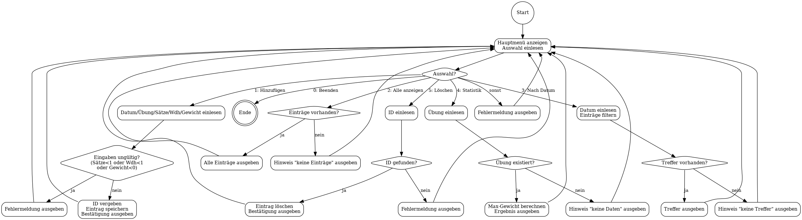

# A4 – Workout Tracker (Prog #3)

## 1) Anforderungsliste (funktionale Anforderungen)

- Das Programm zeigt ein Hauptmenü (Eintrag hinzufügen, Anzeigen, Anzeigen nach Datum, Statistik, Löschen, Beenden).
- Der Benutzer kann einen Trainingseintrag hinzufügen (Datum, Übung, Sätze, Wiederholungen, Gewicht).
- Das Programm prüft Eingaben: Sätze ≥ 1, Wiederholungen ≥ 1, Gewicht ≥ 0.
- Jeder Eintrag bekommt eine eindeutige ID, damit man ihn löschen kann.
- Der Benutzer kann alle Einträge anzeigen lassen.
- Der Benutzer kann Einträge für ein bestimmtes Datum filtern und anzeigen lassen.
- Der Benutzer kann für eine Übung die Statistik „maximales Gewicht“ anzeigen lassen.
- Der Benutzer kann einen Eintrag anhand der ID löschen.
- Das Programm gibt Fehlermeldungen aus, wenn Eingaben ungültig sind oder keine Daten vorhanden sind.
- Das Programm läuft in einer Schleife, bis der Benutzer „Beenden“ auswählt.

## 2) Aktivitätsdiagramm (Textbeschreibung)

Start → Menü anzeigen → Eingabe wählen
→ **Entscheidung (switch Auswahl)**

- **Fall: Eintrag hinzufügen**
  → Daten eingeben
  → validieren
  → speichern
  → zurück zum Menü

- **Fall: Alle anzeigen**
  → Einträge ausgeben
  → zurück zum Menü

- **Fall: Nach Datum anzeigen**
  → Datum eingeben
  → Einträge filtern
  → ausgeben
  → zurück zum Menü

- **Fall: Statistik anzeigen**
  → Übung eingeben
  → maximales Gewicht berechnen
  → Ergebnis ausgeben
  → zurück zum Menü

- **Fall: Eintrag löschen**
  → ID eingeben
  → Eintrag finden
  → löschen oder Fehlermeldung
  → zurück zum Menü

- **Fall: Beenden**
  → Ende

